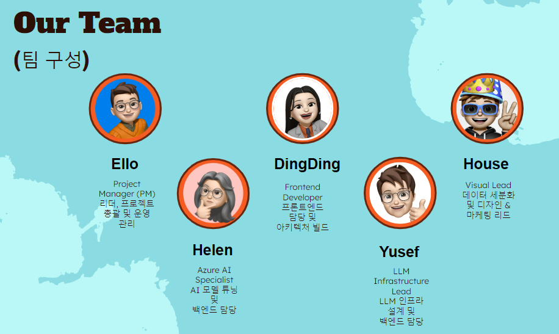
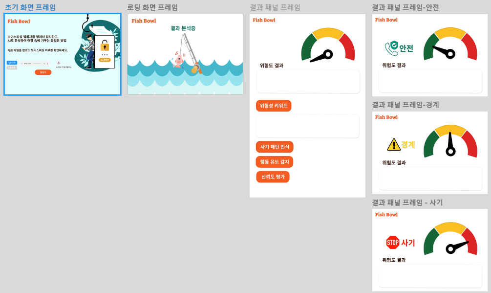
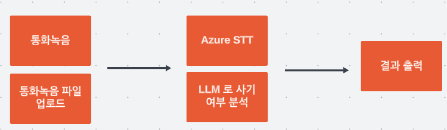
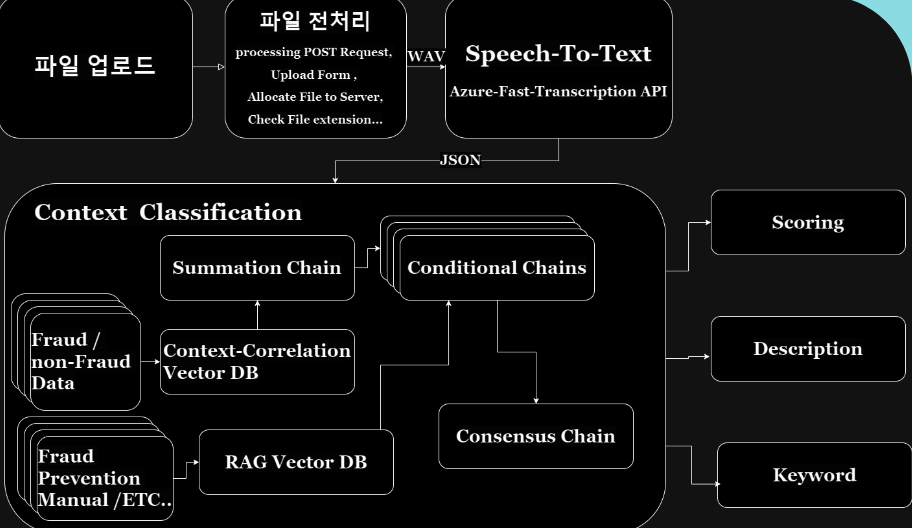
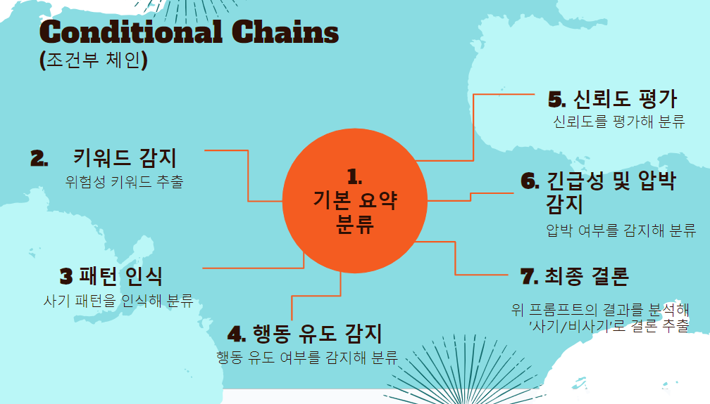

    

    
    

    
 
    <h2 style="border-bottom: 1px solid #d8dee4; color: #282d33;"> 프로젝트 소개 </h2>  
    
 
    <li> 'Fish Bowl'이라는 이름은 보이스피싱 범죄자들을 철저히 식별하고 감지하여 그들을 어항(Fish Bowl)에 가두겠다는 의미를 담고 있습니다.
    </li>
    <li>
     이 프로젝트는 보이스피싱으로 인한 피해를 최소화하고, 사회적 안전을 강화하기 위해 개발되었습니다.
    이는 보안의 강화와 피싱범들을 무력화시키겠다는 의지를 반영하는 저희 팀의 사명 입니다.
     </li>

</li>
<h2>시연 영상</h2>
<ul>
    <li> 시연영상: <a href="https://youtu.be/-ZyXkWokY8s" target="_blank">https://youtu.be/-ZyXkWokY8s</a></li>
    <li>사기 데이터 시연 영상: <a href="https://youtu.be/rFufXf4fpF4" target="_blank">https://youtu.be/rFufXf4fpF4</a></li>
    <li>비사기 데이터 시연 영상: <a href="https://youtu.be/cVFz0MUp3s0" target="_blank">https://youtu.be/cVFz0MUp3s0</a></li>
</ul>
         

 <h2 style="border-bottom: 1px solid #d8dee4; color: #282d33;"> Our Team </h2>   

</a>
    
 
    

    

    <h2 style="border-bottom: 1px solid #d8dee4; color: #282d33;"> Tech Stacks </h2>   
    <link rel="stylesheet" href="https://cdnjs.cloudflare.com/ajax/libs/font-awesome/6.0.0-beta3/css/all.min.css">

 
</a>
</a>

 

    

<h2 style="border-bottom: 1px solid #d8dee4; color: #282d33;"> Wireframe </h2>  

<h2 style="border-bottom: 1px solid #d8dee4; color: #282d33;"> Work-Flow </h2>  

<h2 style="border-bottom: 1px solid #d8dee4; color: #282d33;"> 데이터 출처 </h2>  
 <ul>
    <li><a href="https://www.fss.or.kr/fss/bbs/B0000203/list.do?menuNo=200686" target="_blank">금융감독원</a></li>
    <li><a href="https://aihub.or.kr/aihubdata/data/view.do?currMenu=115&topMenu=100&aihubDataSet=realm&dataSetSn=98" target="_blank">에이아이 허브</a></li>
    <li><a href="https://portal.kfb.or.kr/finedu/data_view.php?idx=42" target="_blank">은행연합회</a></li>
</ul>
<h2 style="border-bottom: 1px solid #d8dee4; color: #282d33;"> 시스템 아키텍처 </h2>  

1. **파일 업로드**
   - 사용자는 파일을 업로드하며, 시스템은 해당 파일을 처리하기 위해 POST 요청을 받습니다.

2. **파일 전처리**
   - 파일이 서버에 업로드되면 파일의 양식이 확인되고, 확장자가 맞는지 검사한 후 서버에 저장됩니다.

3. **Speech-To-Text**
   - 업로드된 파일이 WAV 파일일 경우, Azure의 Fast-Transcription API를 이용하여 파일을 텍스트로 변환합니다. 변환된 텍스트는 JSON 형식으로 출력됩니다.

4. **Context Classification (문맥 분류)**
   - 텍스트 데이터는 문맥 분류 단계로 넘어가며, 여러 체인을 통해 분석됩니다.
     - **Summation Chain**: 데이터의 주요 요점을 요약하는 과정입니다.
     - **Conditional Chains (조건부 체인)**: 데이터의 특성에 따라 조건을 검토하여 분류하는 단계입니다. 다음의 세부 분석을 포함합니다:
       1. **기본 요약 분류**: 입력된 데이터의 기본 요약 정보를 분류합니다.
       2. **키워드 감지**: 위험성 키워드를 추출하여 데이터의 위험성을 분석합니다.
       3. **패턴 인식**: 사기 패턴을 인식하고 이를 바탕으로 데이터를 분류합니다.
       4. **행동 유도 감지**: 데이터가 특정 행동을 유도하는지 여부를 감지하여 분류합니다.
       5. **신뢰도 평가**: 데이터의 신뢰도를 평가하여 사기 가능성을 분류합니다.
       6. **긴급성 및 압박 감지**: 긴급성을 포함하는 요소가 있는지 분석하여 분류합니다.
       7. **최종 결론**: 모든 조건부 분석 결과를 종합하여 해당 데이터가 사기인지 여부를 판단합니다.
     - **Consensus Chain**: 여러 체인의 결과를 종합하여 최종 결론을 도출합니다.

5. **Vector DB 및 사기 탐지 데이터베이스**
   - 사기 및 비사기 데이터를 기반으로 컨텍스트-상관 벡터 데이터베이스(Context-Correlation Vector DB)와 사기 예방 매뉴얼 등의 참조 데이터를 저장한 RAG 벡터 데이터베이스(RAG Vector DB)가 분석에 사용됩니다.

6. **결과 출력**
   - 분석 결과로 스코어링, 설명, 키워드 등이 도출됩니다. 이를 통해 업로드된 파일이 사기 여부에 대한 점수를 매기고, 해당 파일의 설명 및 주요 키워드를 추출합니다.

